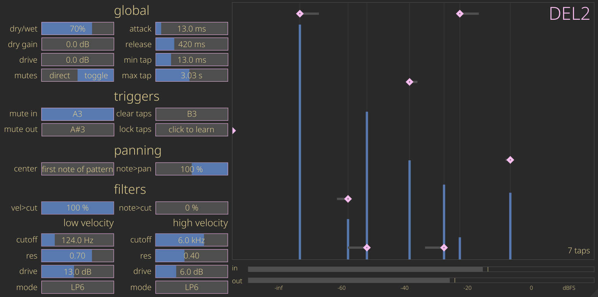

# DEL2

A rhythm delay with crunch.

    

## Current features

- Tap a rhythm into your delay using midi
- Each delay tap has a separate (non-linear) filter
- The filter parameters are pair of settings, and each tap's settings is an interpolation between these two, depending on the velocity

## Planned features

- Tap the rhythm using your computer keyboard or side-channel audio
- Expand the DSP per tap to:
  - two non-linear filters
  - a reverb
  - a panner, using either:
    - level
    - haas + EQ + level 
    - HRTF
- Compressor and ducker on the output
- Optional individual settings per tap
- Optional auxiliary outputs per tap
- BPM sync, scale and quantization

## Thanks

This plugin would not have been possible without the following projects:
- [NIH-plug](https://github.com/robbert-vdh/nih-plug)
- [Vizia](https://github.com/vizia/vizia)
- [va-filter](https://github.com/Fredemus/va-filter)
- [synfx-dsp](https://github.com/WeirdConstructor/synfx-dsp)

I would like to thank [Robbert van der Helm](https://github.com/robbert-vdh), [Fredemus](https://github.com/Fredemus) and [WeirdConstructor](https://github.com/WeirdConstructor) for their fantastic support and feedback!   
